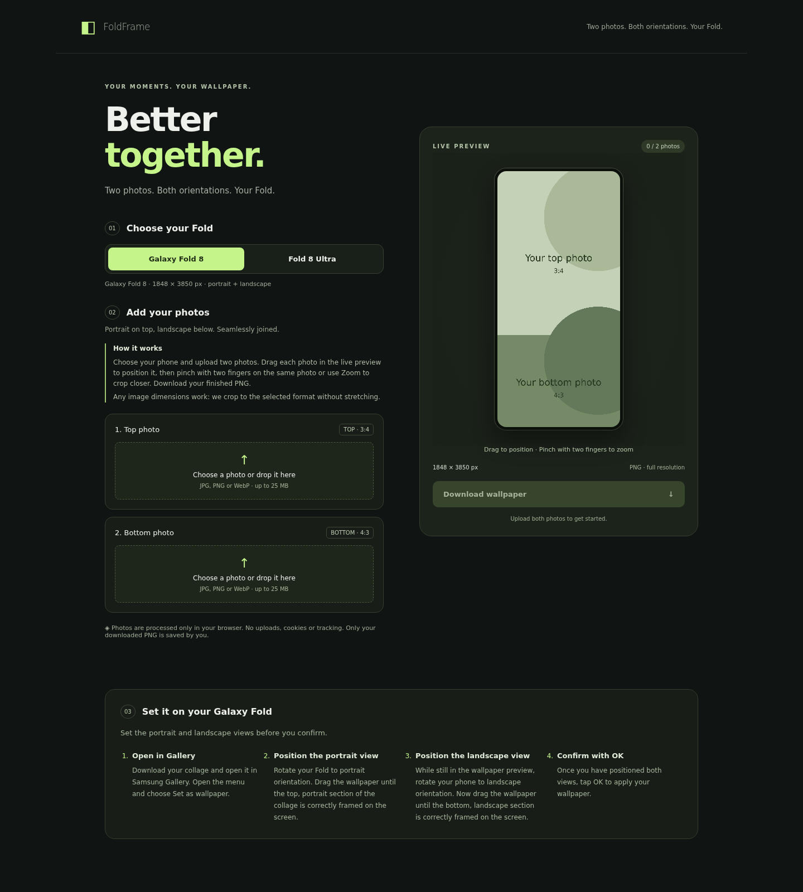

> **Built with AI:** FoldFrame was created with **GPT-6 Astra**.

# FoldFrame

*Two photos. Both orientations. Your Fold.*

[Open the demo](https://karbrueggen1.github.io/foldframe/)



FoldFrame is a wallpaper collage generator for the Galaxy Fold 8 and Fold 8 Ultra. Combine a portrait section and a landscape section into one PNG, then position each section in your phone’s wallpaper editor for its matching orientation.

All image editing happens locally in your browser. The app runs as a static website in a small Nginx Docker container, with no image uploads or database.

## Features

- Device toggle with separate image proportions for Fold 8 and Fold 8 Ultra.
- Two photo inputs with drag and drop; source images do not need to match the final dimensions.
- Live cropping and positioning with a mouse or touch.
- Two-finger pinch zoom, plus keyboard-accessible position and zoom sliders.
- Full-resolution PNG export matching the preview, with a four-character random filename suffix.
- Responsive English interface and an on-page wallpaper setup guide.
- No accounts, analytics, cookies or persistent storage of your photos.

## Build and run with Docker Compose

You need Git, Docker Engine (or Docker Desktop), and the Docker Compose plugin. Docker must be running. No Node.js, npm, Python or frontend build tools are required.

### 1. Get the source

```sh
git clone https://github.com/karbrueggen1/foldframe.git foldframe
cd foldframe
```

Run the following commands from the directory containing `Dockerfile` and `compose.yaml`.

### 2. Build and start

```sh
docker compose up -d --build
```

Docker downloads the Nginx base image and copies the HTML, CSS and JavaScript into it. The first build requires internet access. The container runs in the background and restarts automatically unless you stop it.

Open **http://localhost:8080** on the host, or `http://<server-ip>:8080` from another device on your network. The server’s firewall must allow the chosen port for those devices.

To use a different port, create a `.env` file next to `compose.yaml`:

```dotenv
PORT=8090
```

Then run `docker compose up -d --build` again and open port 8090 instead. The default port mapping listens on all host interfaces.

### 3. Check, update and stop

Check the service and its HTTP endpoint:

```sh
docker compose ps
curl -fsS http://localhost:8080/health
```

The health endpoint returns `ok`. Replace 8080 if you changed the port. Container logging is intentionally disabled; check configuration errors with:

```sh
docker compose exec fold-wallpaper nginx -t
```

To update a clean Git checkout and rebuild:

```sh
git pull --ff-only
docker compose up -d --build
```

To stop and remove the container:

```sh
docker compose down
```

No database setup, upload directory or persistent data volume is needed.

## Build and run without Compose

If you prefer plain Docker, use this **instead of** the Compose deployment:

```sh
docker build -t foldframe .
docker run -d --name foldframe \
  --restart unless-stopped \
  --log-driver none \
  --security-opt no-new-privileges:true \
  -p 8080:80 \
  foldframe
```

Open http://localhost:8080. To stop and remove this container:

```sh
docker stop foldframe
docker rm foldframe
```

The image includes the same Nginx configuration and health check. After changing the source, rebuild the image and recreate the container to deploy the change.

## Host as a static website

The app needs only three files: `index.html`, `style.css` and `app.js`. You can serve those files together from any static web server; there is no compilation step or backend API.

Keep their relative paths intact. Configure the host to serve `index.html` as the default document. For a deployment equivalent to the Docker version, apply the security and cache headers from `nginx.conf` and disable request logging at the host.

Publishing the repository on GitHub and hosting the website are separate actions. On GitHub Pages or another managed static host, the Docker/Nginx configuration does not run, and the provider controls its own infrastructure logs. See the privacy section below.

## How to use

1. Choose Galaxy Fold 8 or Fold 8 Ultra.
2. Select or drop a photo into each field. JPG, PNG and WebP are supported, up to 25 MB and 60 megapixels each. Any source dimensions or orientation are accepted.
3. Drag either photo directly in the preview with a mouse or touch to position its crop. Pinch with two fingers on the same photo to zoom in or out (1×–3×), or use its Zoom slider. You can keep dragging with one finger after lifting the other. Horizontal and Vertical sliders also allow precise positioning with a keyboard. Reset crop restores the centered, minimum-zoom view.
4. Download the finished PNG. The preview and export use the same crop. Each download gets four random letters/digits after `collage`, for example `galaxy-fold8-collage-A7K2-1848x3843.png`.

Photos automatically fill their frames without stretching or gaps. At minimum zoom, one axis may already fit exactly; increase zoom to move the photo along that axis. The frame proportions stay fixed while you edit. The two images meet edge to edge; the decorative preview border is not exported.

## Apply the wallpaper on your Fold

1. Download the PNG, open it in **Samsung Gallery**, and choose **Set as wallpaper** from the menu.
2. Rotate your Fold to **portrait** orientation. Drag the wallpaper until the **top, portrait section** is correctly framed.
3. While still in the wallpaper preview, rotate your phone to **landscape** orientation. Drag the wallpaper until the **bottom, landscape section** is correctly framed.
4. Once both views are positioned, confirm with **OK**.

## Formats

| Phone | Top ratio (width:height) | Bottom ratio | PNG size | Top pixels | Bottom pixels |
| --- | --- | --- | --- | --- | --- |
| Galaxy Fold 8 | 77:102 | 102:77 | 1848 × 3843 | 1848 × 2448 | 1848 × 1395 |
| Galaxy Fold 8 Ultra | 282:313 | 313:282 | 2256 × 4537 | 2256 × 2504 | 2256 × 2033 |

Both models use their actual inner-display proportions. The bottom section is scaled to the same width as the top, with its height rounded to the nearest whole pixel: Fold 8, 1395.06 → 1395; Fold 8 Ultra, 2032.61 → 2033. Switching devices updates both frames and retains the selected photos. The combined collage is taller than the inner display; your phone may crop it when applying it as a full-screen wallpaper.

Ultra proportions are based on the 2256 × 2504 inner display in [Samsung's comparison, updated August 12, 2026](https://www.samsung.com/ie/support/mobile-devices/what-is-the-difference-between-the-galaxy-z-fold8-ultra-and-z-fold8/), accessed September 7, 2026. Fold 8 proportions are based on its [1848 × 2448 inner-display resolution](https://www.samsung.com/uk/business/smartphones/galaxy-z/galaxy-z-fold8-lavender-256gb-sm-f971blvbeub/), also accessed September 7, 2026. Its commonly stated 3:4 / 4:3 format is approximate; FoldFrame uses 77:102 / 102:77 instead. Device settings are at the top of `app.js`.

## Technical notes

- Plain HTML, CSS and JavaScript; no external fonts, libraries or CDNs.
- Photos are never uploaded to the server or saved persistently. Reloading clears them.
- A modern browser supporting Canvas, Pointer Events and `createImageBitmap` is required. Convert HEIC to JPG, PNG or WebP first.
- Docker Compose includes an automatic restart policy and an HTTP health check at `/health`.
- Nginx serves HTTP with security headers and a Content Security Policy.

## Privacy and public hosting

- Selected photos and crop settings live only in browser memory. There is no image upload endpoint, database, browser storage, analytics, tracking or cookie usage.
- The PNG is generated locally. It is saved to the visitor's device only when they choose Download. Original files on their device are unaffected.
- Nginx access and error logging are disabled. Docker's logging driver is set to `none`. This intentionally disables container logs for troubleshooting too.
- Responses include `Cache-Control: no-store`. The app does not use a service worker or persistent browser cache of its own.
- The Content Security Policy blocks script-initiated network connections (`connect-src 'none'`). All site assets are served locally, without third-party fonts or scripts.
- Serving the website still requires handling visitors' network requests and IP addresses transiently. A reverse proxy, CDN, tunnel or hosting provider may keep its own logs. Configure that infrastructure separately; these Docker settings cannot control it.
- Publishing the source on GitHub does not publish visitors' photos. If hosting the site on GitHub Pages or another static host, `nginx.conf` and Docker's logging settings do not apply there. Check the host's logging and privacy controls before claiming that no visitor data is retained.

Logs from earlier deployments are not retroactively erased by this configuration. Recreating this Compose container removes its previous container-local logs; external log copies or backups require separate handling.
